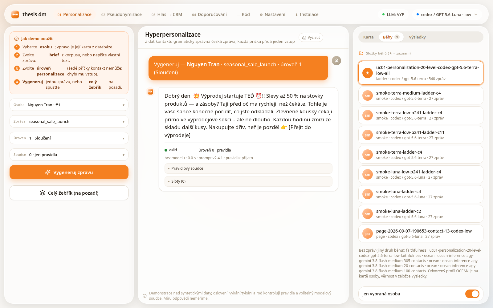
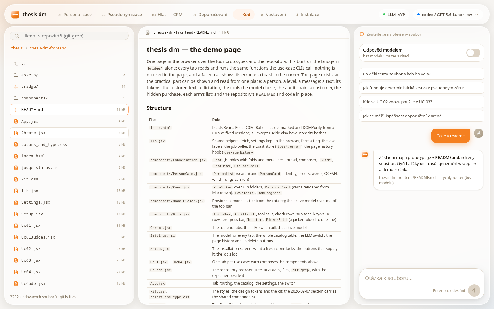

# Implementation of Large Language Models into a CRM System

[](https://github.com/Haki-22/Implementation-of-Large-Language-Models-into-a-CRM-System/actions/workflows/tests.yml)

The research prototype accompanying the Master's thesis of the same name
(Lukáš Sittek, 2026; in Czech: "Implementace Large Language Modelů do CRM systému").
It evaluates four uses of language models on a shared synthetic Czech CRM dataset:
personalized messages, reversible masking of personal data, controlled access to CRM
tools, and product recommendations. The focus is empirical evaluation and risk
reduction, not a production CRM system.

The repository contains the implementations, input snapshots, saved experiment
outputs, and a browser interface for trying all four use cases. It is self-contained.
Run the commands below from the repository root, the directory containing this README
and `pyproject.toml`. The directory can have any name. Documentation is in English;
the interface and CRM examples are in Czech.



## Quickstart

Start with a clone or an extracted copy of the repository. The commands below use
Python 3.12 and a Linux shell. They create an isolated Python environment, install
the pinned dependencies and the local packages, and start the browser interface.

```bash
python3.12 -m venv .venv
source .venv/bin/activate
python -m pip install -e .
./thesis-dm-frontend/bridge/run.sh
```

Open `http://127.0.0.1:8765/dm/` if the browser does not open automatically.
Keep the terminal running; stop the server with Ctrl-C. For later starts, activate
the same environment and run `bridge/run.sh` using the path above.

The page opens on **Instalace** (installation) when the database is missing.
The repository ships five large snapshots compressed (`.json.gz`), but no built
database or model weights. Click **Připravit stránku** (prepare the page) to:

1. Unpack the snapshots, including the saved Czech translation. Setup reuses
   this translation rather than calling a translation service again.
2. Build `substrate/snapshots/substrate.db` from those snapshots.
3. Download the default local models: UC-02's named-entity recognition (NER)
   model, which finds names and other personal data, and UC-03's Whisper medium
   model, which transcribes speech. These downloads are automatic in this setup plan.

No Hugging Face account is needed: both models are public. The screen still
accepts a token (stored where the hub client reads it) for the day a gated model
or an anonymous-download limit demands one.

A second button, **Úplná rekonstrukce** (full reconstruction), downloads the raw
Amazon, Czech Statistical Office and Czech Post inputs, checks their recorded
checksums, and rebuilds the data layers while retaining frozen model-produced
inputs. This is optional: the supplied snapshots are enough to use the prototype.
See [substrate/README.md](substrate/README.md) for the build chain.

External model calls are off by default. To use live generation or the UC-03 chat,
install and authenticate a supported provider CLI separately, select it in the
page, and enable model calls. Local NER and Whisper do not need this switch.

### Storage

As measured on 2026-09-08, the clean code-and-data export is approximately **0.32 GB**.
The working installation occupies **10.26 GB inside the project directory**, including
the Python environment (7.16 GB), downloaded Whisper weights (1.53 GB), unpacked
snapshots, the database and local run files. These are apparent sizes measured with
`du -sb`, using decimal GB (1 GB = 1,000,000,000 bytes), not fixed disk requirements.

The Hugging Face cache outside the project is **not included** in that total.
Optional comparison models, raw downloads, package caches and additional runs need
more space; the installed size also depends on the platform and Python wheels.

### Data-only setup

To prepare only the data from the command line, first inspect the inputs, then
build the database. The last command is the optional full reconstruction and can
replace generated data files; it is not needed for a normal installation.

```bash
python -m substrate.pipeline.build_all --verify                  # unpacks the shipped snapshots, then checks every input; on a fresh clone it reports the raw dumps as missing and exits 1, which is expected
python -m substrate.pipeline.build_all --force --from database   # unpack + build the database
python -m substrate.pipeline.build_all --force                   # full rebuild from the raw dumps
```

## Structure

| Path                  | Role                                                                                                                             |
| --------------------- | -------------------------------------------------------------------------------------------------------------------------------- |
| `substrate/`          | Shared synthetic CRM data, SQLModel schema, snapshot generators, and the database build pipeline.                                |
| `ucs/`                | Four use-case packages. Each owns its implementation, local snapshots, evaluation helpers, and README.                           |
| `utils/`              | Shared path constants, file-safety helpers, prompt models, and local LLM generation wrappers.                                    |
| `thesis-dm-frontend/` | The page (React, no build step) and its FastAPI bridge: every tab runs and reads the four use cases and browses this repository. |
| `tests/`              | Pytest suite covering generators, substrate helpers, UC code paths and the bridge.                                               |
| `holdout/`            | Frozen copy of the UC-01 judge calibration set; not an independent test set.                                                                     |
| `attachments/`        | Generated tables and measurements used by the thesis appendices, with links to their producers.                                  |
| `basic-prompt-how-to.py` | The prompt-writing reference the project's prompts were drafted from: nine sourced rules, anti-patterns, a short-versus-long demo. Czech and English; nothing imports it. |
| `LICENSE`, `NOTICE.md` | MIT licence for the code; the terms of the third-party data, model weights and services the prototype uses.                   |
| `.github/workflows/`  | The offline test suite on a clean machine, run by GitHub Actions on every push.                                                  |

The project is organized around a single shared substrate and four UC packages:

- `substrate/` answers how the synthetic CRM data was built.
- [UC-01](ucs/uc01_personalization/README.md) generates Czech CRM messages from contact details, writing examples, Big Five personality profiles and UC-04 recommendations.
- [UC-02](ucs/uc02_pseudonymization/README.md) replaces personal data with tokens before an LLM call and restores the original values afterwards.
- [UC-03](ucs/uc03_mcp_privacy/README.md) connects a chat to CRM tools through the Model Context Protocol (MCP), with UC-02 masking, access restrictions and a hash-chained audit log. Local Whisper provides optional dictation.
- [UC-04](ucs/uc04_matchmaker/README.md) compares twelve classical recommendation methods and five language-model methods under two evaluation protocols and two data regimes.

The canonical shared database is `substrate/snapshots/substrate.db`. Most
runtime code reads from that database or from committed JSON snapshots under
`substrate/snapshots/`.

## Headline findings

The use-case summaries below link the measured results to their saved run folders.

- **UC-01** ([card](ucs/uc01_personalization/eval/RESULTS.md)). Across the 15 rungs of the
  personalisation ladder, 459 messages for 20 contacts and 3 briefs, the rules judge accepted
  the greeting, the T/V register and the gender in 339 of 339 model-written messages.
  Mirroring a contact's personality profile changes 51 % of the words of the profile-level
  message on average, so the profile is used; whether it is used well is a reading task, not a number.
- **UC-02** ([card](ucs/uc02_pseudonymization/eval/RESULTS.md)). On a 100-message Czech CRM corpus
  with 345 planted personal-data items, checksummed rules plus the bardsai NER found 345 of 345
  with no false alarm (strict F1 1.000) and restored 100 of 100 messages exactly; rules alone
  reach F1 0.560 and the best NER alone 0.725, showing the hybrid's gain on this corpus. The price: on
  ordinary review text the NER layer touches 73 % of texts against under 2 % for the rules,
  and lower-case input drops the hybrid to F1 0.914.
- **UC-03** ([package](ucs/uc03_mcp_privacy/README.md), [evaluation](ucs/uc03_mcp_privacy/eval/README.md)).
  Fifteen CRM tools behind an MCP server with three security profiles, UC-02 masking at the
  protocol boundary, a hash-chained audit log and a pinned tool manifest that fails closed on
  drift. Speech input is measured on a 20-clip synthetic Czech corpus with two Whisper sizes;
  the middleware's own tool-call accuracy is not measured yet, and the package says so.
- **UC-04** ([card](ucs/uc04_matchmaker/eval/RESULTS.md)). Twelve classical recommenders and
  five language-model methods on 425 customers. On sampled lists of one hidden purchase
  among 100 negatives the best classical arm hits 154 of 425; learning from the public
  population lifts ALS from 119 to 182. A language model ranking the same lists hits 64 of
  100 against ALS's 28, and re-ranking ALS's top 200 against the whole catalogue lifts 6 to 11
  of 44 hits. Several text-based arms lose on Czech (the encoder arm 94 to 46 hits),
  while BM25 improves from 57 to 75.

## Limitations

- The data are synthetic contacts and companies around real Amazon reviews; the prototype
  is a demonstration over that data, not a production CRM, and what it shows is feasibility.
- Calls to hosted language models are not reproducible; the saved run folders are the
  evidence, and a new run may answer differently. The Czech translation of the reviews is
  frozen from one run on 2026-05-29 and is never re-run.
- UC-02 is measured on model-written prose around planted values; real notes may be
  messier. The unannotated Amazon reviews contain some reviewer-provided personal
  information. The review-text check therefore reports detection rates, not verified
  false-positive rates; its original assumption that every detection was a false alarm
  does not hold.
- UC-03 measures speech recognition and the guarantees of the envelope; the tool-call
  accuracy of the model over the middleware is not measured.
- UC-04's full-catalogue evaluation includes 108 hidden items bought by nobody else
  in the CRM data, limiting methods that rely on shared purchases. The page is a beta
  demonstrator built last.
- The code was written with the help of AI coding assistants and, by the nature of the
  work, tested with them too, so it may have shortcomings the author is not aware of today.
  Suggestions for improvement are welcome. The assistants worked from the prompting reference
  in `basic-prompt-how-to.py`; the prompts the use cases send are versioned in the code, and
  each run folder records the calls it made.

## The page

`./thesis-dm-frontend/bridge/run.sh` starts one FastAPI process that serves the
page at `/dm/` and exposes every route the page uses; the page has no build
step; its browser libraries load from a CDN at fixed versions). One tab per use
case, a **Kód** tab that browses this
repository as git tracks it (start at this README, follow the links to the
others, read the code with line numbers, search with `git grep`), **Nastavení**
for the model of every tab (from the generated catalog), and **Instalace**.
UC-01 also offers rules-only checking, one model judge, two judges, or two judges
with conditional arbitration. Each model role has its own provider, model and
reasoning-effort selection.
Details, tab by tab, in
[thesis-dm-frontend/README.md](thesis-dm-frontend/README.md).



The **Kód** search requires Git and an index of the intended source files. A normal
Git clone already has both. An archive or directory copy does not: `git init` creates
the repository, but search only covers files subsequently added to its index.
Review `.gitignore` before staging files so environments, secrets, databases and
downloaded weights are not included. No initial commit is needed for this search.

Use-case runs started from the page write their own folders and refresh appendix
files under the bridge's runtime folder, leaving the published experiment folders
unchanged. Model runs from the page are comparisons on a sample, and the UC-03
chat writes into a scratch copy of the database. Installation and reconstruction
are separate operations that can rebuild the shared data.

## How to use from the command line

### Prerequisites

| Required              | Notes                                                                                                                                                            |
| --------------------- | ---------------------------------------------------------------------------------------------------------------------------------------------------------------- |
| Python 3.12           | `requires-python = ">=3.12"` in `pyproject.toml`.                                                                                                                |
| Internet access | The page loads its browser libraries from a CDN; local models are downloaded on first use (NER ~1 GB, `faster-whisper-medium` ~1.5 GB). A full rebuild also fetches the raw dumps (~1.5 GB). |

Optional, only needed for specific code paths:

| Optional                                                 | Used by                                                                                                                                                                                                                               |
| -------------------------------------------------------- | ------------------------------------------------------------------------------------------------------------------------------------------------------------------------------------------------------------------------------------- |
| Authenticated `claude`, `codex` or `agy` CLI on `PATH` | Live text generation and UC-03 MCP chat. UC-03 supports all three hosts; agy additionally needs explicit MCP tool permissions, described in the [UC-03 setup](ucs/uc03_mcp_privacy/README.md#agy-setup-and-limits). |
| `GOOGLE_APPLICATION_CREDENTIALS` env var                 | only the optional Google Cloud STT backend in `ucs/uc03_mcp_privacy/stt.py`, kept for the local-versus-cloud comparison; the default STT is local `faster-whisper`, and both Google backends are behind the `THESIS_LLM_CALLS` switch |
| System package: PulseAudio `parec` | Microphone dictation in the CLI (`chat --dictate`). The page records through the browser instead; WAV files and typed chat work without it. |
| Additional detector weights and spaCy language model | UC-02 comparison backends only. They are loaded when selected, not by the standard GUI setup; Presidio uses its default English NLP model with added Czech patterns. |
| Separate `.venv-nametag3` environment and NameTag 3 assets | Optional Czech NER comparator. NameTag is not the default detector and is not required for the GUI or the current 23-configuration detection table. Its asset-download helper is missing from this export, so its setup is not yet automated here. |

`pip install -e .` is the canonical install path: `pyproject.toml` reads the pinned
`requirements.txt` via `[tool.setuptools.dynamic]`, so the one command installs the
dependencies and makes the local packages importable. The examples here assume the
repository root as the working directory. Activating an environment only selects
its Python interpreter; it does not install missing dependencies.

### Main commands

```bash
# Shared generation CLI options
python -m utils.generation.cli --list-options

# Build the substrate database (also what the Instalace screen runs)
python -m substrate.pipeline.build_all --force --from database

# UC-01: one message, one contact, one level (no model at level 1; mock costs nothing)
python -m ucs.uc01_personalization generate --contact 11 --brief 26 --level 1
python -m ucs.uc01_personalization generate --contact 11 --brief 26 --level 3 --provider mock

# UC-02 evaluation suite
pytest tests/ucs/uc02_pseudonymization/ -q

# UC-03: a live chat turn; Codex starts the MCP server for this session
python -m ucs.uc03_mcp_privacy.chat --provider codex --text "Najdi kontakt Novák" --force-llm

# UC-04 recommender arena (no model calls; writes eval/runs/<folder>/)
python -m ucs.uc04_matchmaker run --arms fast

# The bridge's tests (code-search tests require an indexed Git repository)
pytest tests/frontend -q -m "not live"

# The whole offline suite (about 70 s once the NER model is cached; the same run as the CI badge).
# Run the data setup first: tests that read the database or the unpacked snapshots skip without it.
pytest -q -m "not live"
```

GitHub Actions runs the same suite after installation and data setup on each push
and pull request. Open **Actions → tests** to inspect the run and its logs. Once
the workflow is on the default branch, **Run workflow** starts it manually.
Here, "offline" means no hosted LLM calls: the NER tests can download local model
weights, and the Whisper tiny test skips if its weights are absent.

The UC-01 examples demonstrate template filling and offline mock generation.
UC-02 tests check masking and restoration. UC-03 is the only example above that
explicitly enables a live provider call and consumes that provider's quota.
The UC-04 example evaluates classical recommenders and saves a new result folder.
Use each command's `--help` and the linked UC README for further options.

### Model calls are off by default

Every paid or external call (the Codex / Claude / agy CLI adapters in
`utils.generation`, the UC-03 Google speech backends, the frozen translation
stage) is behind one switch, `THESIS_LLM_CALLS`. With the switch off, which is
the default, such a call fails closed with a hint and nothing is spent; the
offline `mock` text-generation provider works without it. This does not provide a
mock MCP host: the UC-03 chat needs a live, authenticated provider.

```bash
python -m utils.llm_switch      # prints the current state and where it comes from
python -m ucs.uc01_personalization run --levels 2 --provider codex --force-llm
```

The second command explicitly permits calls for that run. For a persistent local
setting, create `.env` from `env.example` if it does not already exist, and set
`THESIS_LLM_CALLS=TRUE`. The process environment, `--force-llm`, and the page's
ON/OFF switch override the file for their process. Details: `utils/llm_switch.py`.

### Reproducibility

The supplied snapshots and experiment folders are part of the evidence, not
disposable caches. Each UC's results summary links to the runs behind its numbers.
Those folders retain configurations and detailed outputs, including predictions
or generated messages as applicable. [attachments/README.md](attachments/README.md)
identifies the producers of the appendix tables.

Reading saved results or rebuilding a table from saved outputs is different from
running inference again. A new model run consumes compute or provider quota and
may produce different answers. Match the recorded inputs, parameters, package
versions and model revisions when comparing runs; a fixed seed alone does not
make an external service reproducible. `requirements.txt` pins the main packages,
but `tokenizers` and transitive dependencies are not fully locked. Individual run records describe the environment
used for that measurement.

What a fresh clone reproduces was checked on 2026-09-09: after `pip install -e .` and the
data setup, the offline suite passed. Regenerating the appendix tables and UC-01 result
card from saved runs reproduced their contents apart from generation dates. The UC-04
card also preserved its measurements, but reordered the two secondary-provider
comparison sections and their provenance references. The UC-02 detection table
reproduced the recorded F1 of the rules and of rules + bardsai, and the classical UC-04
arena (`run --arms fast`) reproduced the recorded hits of eight of the nine arms, Apriori included, under the pinned mlxtend 0.23.4. The LightGBM arm moved
(CRM regime, whole catalogue 3 → 1 hits, sampled lists 145 → 152 of 425) despite a fixed
seed, four pinned threads and deterministic histograms. Its source comment already records
that it moves by a few hits between processes, the [UC-04 README](ucs/uc04_matchmaker/README.md)
reports the same for a second full run, and the move stays inside its 95 % interval on the
sampled protocol.

For example, this command reruns UC-02's rules and default NER combination on the
supplied corpus and saves a new detection-table run. It uses local models, downloads
missing weights on first use, and does not call a hosted LLM:

```bash
python -m ucs.uc02_pseudonymization.eval.run_table \
    --configs rules,rules+bardsai --tag detection-check
```

Omit `--configs` to evaluate all current detector backends, which requires their
additional assets. The saved September detection table has 23 configurations on
100 messages. The older `eval/fusion_refresh/` folder preserves the May experiment
on 69 messages; its harness is not compatible with the current package and is not
the current reproduction entry point. NameTag predictions for a new corpus must
be regenerated, not taken from that older experiment.

A SHA-256 hash identifies the exact bytes of an input file. A rebuilt SQLite file
can have a different hash even when its logical data agrees. Some older runs lack
this metadata, including the saved UC-01 ladder run of 2026-09-07. A hash calculated
today cannot establish which database that older run used, so missing historical
hashes are not filled in retrospectively without supporting evidence.

## Outputs

- `substrate/snapshots/substrate.db` — the shared SQLite database all UCs read.
- `ucs/uc01_personalization/snapshots/runs/` — UC-01 run folders (the ladder, faithfulness, smokes) and `eval/RESULTS.md`, the one-page card.
- `ucs/uc02_pseudonymization/eval/runs/` — UC-02 run folders (detection table, false alarms, the sandwich) and `eval/RESULTS.md`.
- `ucs/uc03_mcp_privacy/eval/` — saved speech-transcription measurements, synthetic audio and the evaluation README explaining their limits.
- `ucs/uc03_mcp_privacy/.runtime/` — UC-03 audit logs, session maps and generated MCP configs of local runs (gitignored); the tool manifest pin itself is committed as `ucs/uc03_mcp_privacy/tool_manifest.json`.
- `ucs/uc04_matchmaker/eval/runs/` — UC-04 run folders: config, per-arm scores, TABLE.md, RESULTS.md; `eval/RESULTS.md`, the card.
- `attachments/` — the appendix files of the thesis, generated from the runs of record.

## Licence and citation

The code is released under the MIT licence ([LICENSE](LICENSE)). The Amazon review data,
the ČSÚ tables, the model weights the prototype downloads and the services that produced
the frozen artefacts keep their own terms, listed in [NOTICE.md](NOTICE.md); the derived
Amazon snapshots are provided for research reproduction only.

To cite the prototype, cite the thesis:

> Sittek, L. (2026). *Implementation of Large Language Models into a CRM System* [Master's thesis,
> written in Czech as *Implementace Large Language Modelů do CRM systému*].
> Code: https://github.com/Haki-22/Implementation-of-Large-Language-Models-into-a-CRM-System

## Next step

Each subdirectory has its own README with deeper detail:

- [thesis-dm-frontend/README.md](thesis-dm-frontend/README.md) — the page, tab by tab, and its bridge.
- [substrate/README.md](substrate/README.md) — how the shared dataset is built.
- [utils/README.md](utils/README.md) — shared helpers + generation wrappers.
- [ucs/README.md](ucs/README.md) — index of the four use-case packages.
- [basic-prompt-how-to.py](basic-prompt-how-to.py) — how the prompts were written, for a reader new to prompting.
